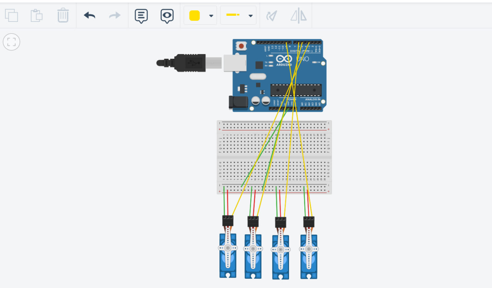

# 4 Servo Motors Sweep and Hold Task 🤖

## 📌 Task Description
This project is programmed to control 4 Servo motors using an Arduino Uno to perform a specific sequence:
1. Run a continuous **Sweep** motion for exactly **2 seconds**.
2. Automatically stop and hold all 4 motors at a **90-degree angle** after the 2 seconds have passed.

## 🔌 Circuit Connection (Wiring)
* **Power & Ground:** A Breadboard is used to distribute the 5V and GND from the Arduino to all 4 motors seamlessly.
* **Signal Wires:**
  - Servo 1 connected to Arduino Digital PWM Pin `3`.
  - Servo 2 connected to Arduino Digital PWM Pin `5`.
  - Servo 3 connected to Arduino Digital PWM Pin `6`.
  - Servo 4 connected to Arduino Digital PWM Pin `9`.

## 💻 Code Logic
The Arduino code utilizes the `millis()` function instead of `delay()` to keep precise track of the 2-second timeframe without blocking the microcontroller. 
- While `millis() < 2000`, a sweep algorithm updates the servo positions back and forth.
- Once 2000ms is reached, a `write(90)` command is executed for all 4 motors simultaneously, holding them perfectly at the 90-degree position.

## 📸 Project Screenshot

## 🎥 Demonstration Video
[Click here to watch the demonstration video]([ضع_رابط_الفيديو_هنا](https://drive.google.com/file/d/1LOGRSYqIens_h0E3fKZAjXmYKTVlfDoc/view?usp=sharing))
